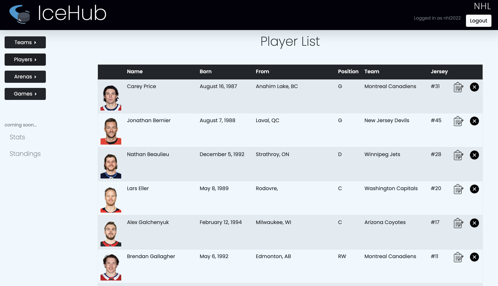
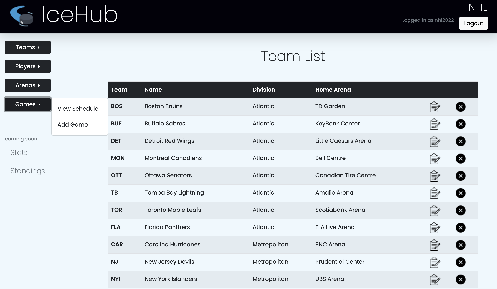
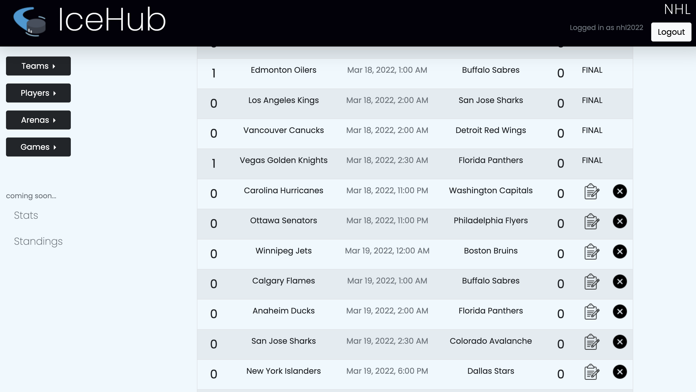
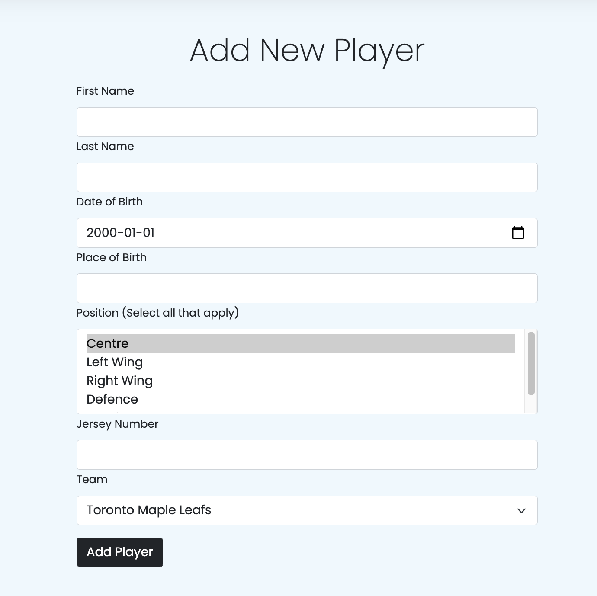
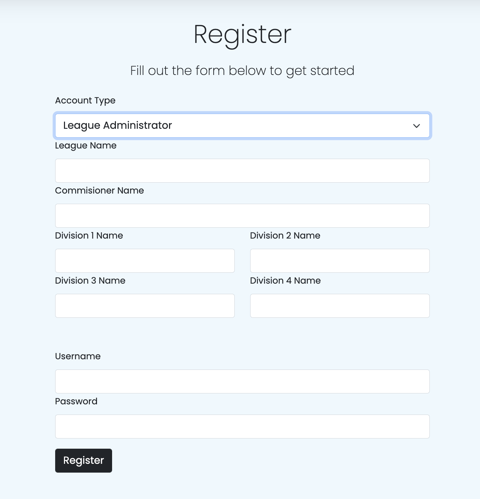

# IceHub - Hockey League Management System

A simple tool for managing all your league data. 
[View site here](https://ice-hub.herokuapp.com/)

 

## Getting Started

Register your league by submitting the necessary data on the registration page. Once an account has been created you are able to add arenas, teams, player info and games to your league as needed. 
  
The homepage of every league site displays current league events, player spotlight, and latest news from the NHL.
 
 

## Technologies Used

<ul>
    <li>CSS</li>
    <li>Express.js</li>
    <li>MongoDB</li>
    <li>EJS Templating Engine</li>
</ul>

 

## Coming Soon...

<ul>
    <li>League stats page</li>
    <li>League standings page</li>
    <li>User accounts for players and team admins</li>
    <li>League event listings</li>
    <li>Player spotlight section</li>
</ul>
 

## Screenshots

#### Player List

#### Team List

#### Schedule

#### Add New Player

#### Register
